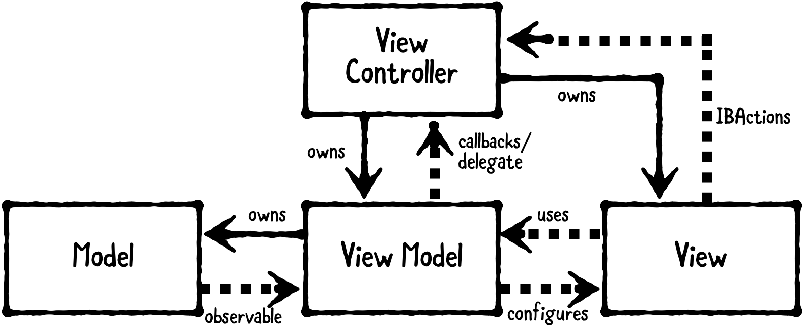

#  MVVM设计思路

### 首先看一下MVVM的类图

Model持有App data，通常使用Struct和一些简单的类，

View显示可视的元素，

ViewModel会把Model的信息转换成值，显示在View上

 ViewController存在于MVVM之中，但是它的角色被最小化了，

你可以在ViewModel中把一个日期转换成格式化的日期字符串，

把一个十进制数转换成一个货币格式的字符串，没有ViewModel的话这些转换都需要在ViewController里面处理，

ViewController就要处理ViewDidLoad以及其他的生命循环事件，处理事件的回调，以及其他的任务，以至于ViewController非常的臃肿，

